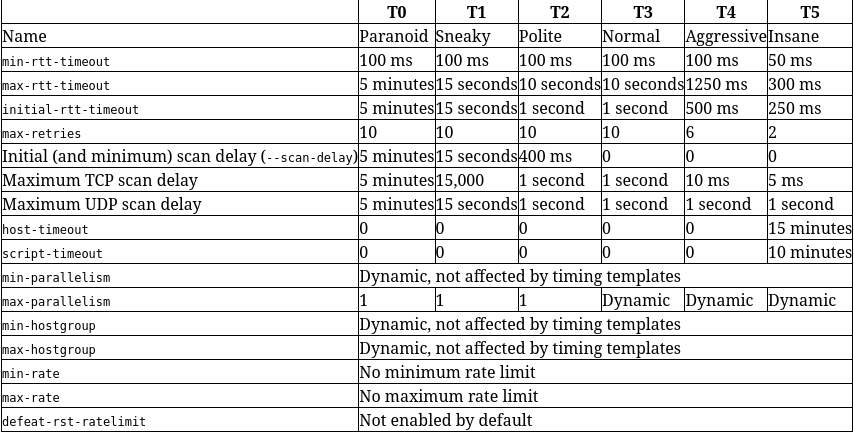

**SYNTAX**
```bash
nmap <scan types> <options> <target>
```

## Host Discover

| Command | Description|
|--------|------------|
| `-sn ` | Disable port scanning. Host discovery only. |
| `-PE` | Performs the ping scan by using ICMP Echo Requests against the target |
| `nmap -sn 10.129.2.12` | Scan Single IP |
| `nmap -sn 10.129.2.0/24` | Scan Network range |
| `nmap -sn -iL hosts.lst` | Scan IP List |
| `nmap -sn 10.129.2.12 10.129.2.13 10.129.2.17` | Scnan Multiple IPs  |
| `nmap -sn 10.129.2.12-18` | Scan Multiple IPs

## Port Scanning

| Command | Description|
|--------|------------|
| `-sS` | Syn Scan |
| `-sT` | TCP Scan |
| `-sU` | UDP Scan |
| `--top-ports=10` | Scans the specified top ports that have been defined as most frequent. |
| `-F` | Fast Scan. Scans top 100 Ports|
| `-Pn` | Treat all hosts as online -- skip host discovery|
| `-p 80` | Only scan Port 80 |
| `-p 80,8080` | scan Ports 80 and 8080 |
| `-p 80-90` | Scan port range |
| `-p-` | Scan all ports |

## Saving The Results

| Command | Description|
|--------|------------|
| `-oN` | Normal output with the **.nmap** file extension |
| `-oG` | Grepable output with the **.gnmap** file extension |
| `-oX` | XML output with the **.xml** file extension |
| `-oA Target` | Saves the results in all formats, starting the name of each file with **Target**.|

## Service and OS Enumeration

| Command | Description|
|--------|------------|
| `-O` | OS Detection |
| `-sV` | Service version enumeration |
| `-A` | Agressive Scanning. Enables OS detection (**-O**), version detection (**-sV**), script scanning (**-sC**), and traceroute (**--tracerout**)  |

## Nmap Scripting Engine (NSE)

| Command | Description|
|--------|------------|
| `-sC` | default NSE scripts. Equivalent to --script=default |
| `--script <category>` | Use specific Scripy category |
| `--script <scripy_Name>,<script_Name>`| Use defined scripts |

### Script Categories

| Script Category | Description |
|--------|------------|
| `auth` | Determination of authentication credentials. |
| `broadcast` | Scripts, which are used for host discovery by broadcasting and the discovered hosts, can be automatically added to the remaining scans. |
| `brute` | Executes scripts that try to log in to the respective service by brute-forcing with credentials. |
| `default` | Default scripts executed by using the -sC option. |
| `discovery` | Evaluation of accessible services. |
| `dos` | These scripts are used to check services for denial of service vulnerabilities and are used less as it harms the services. |
| `exploit` | This category of scripts tries to exploit known vulnerabilities for the scanned port. |
| `external` | Scripts that use external services for further processing. |
| `fuzzer` | This uses scripts to identify vulnerabilities and unexpected packet handling by sending different fields, which can take much time. |
| `intrusive` | Intrusive scripts that could negatively affect the target system. |
| `malware` | Checks if some malware infects the target system. |
| `safe` | Defensive scripts that do not perform intrusive and destructive access. |
| `version` | Extension for service detection. |
| `vuln` | Identification of specific vulnerabilities. |

## Performance

- **rtt** → **Round trip Time** → Time receive a response from the scanned port.  

- Default value for the retry rate is **10**.

| Command | Description|
|--------|------------|
| `--min-rtt-timeout 100ms` | Sets the specified time value as Min RTT timeout. |
| `--max-rtt-timeout 100ms` | Sets the specified time value as Max RTT timeout |
| `--initial-rtt-timeout 50ms` | Sets the specified time value as initial RTT timeout. |
| `--max-retries 0` | Sets the number of retries that will be performed during the scan. |
| `--min-rate 300` | Sets the minimum number of packets to be sent per second. |
| `-T <0-6>` | Time template to use |

### Time Template



**Source [here](https://nmap.org/book/performance-timing-templates.html)**

## Firewall and IDS/IPS Evasion

| Command | Description|
|--------|------------|
| `nmap 192.168.1.1 -D 192.168.1.35, 192.168.1.26, 192.168.1.13, 192.168.1.100 ` | Decoys. Send scans from spoofed IPs |
| `-D RND:5` | Generate five random IPs that indicates the source IP the connection comes from |
| `-S <IP>` | Scans the target by using different source IP address. |
| `-e tun0` | Sends all requests through the specified interface. |
| `--source-port <Port Number>` | Perform the scans from the specified source port |


# Mission Complete

